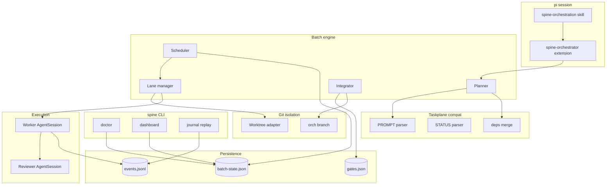
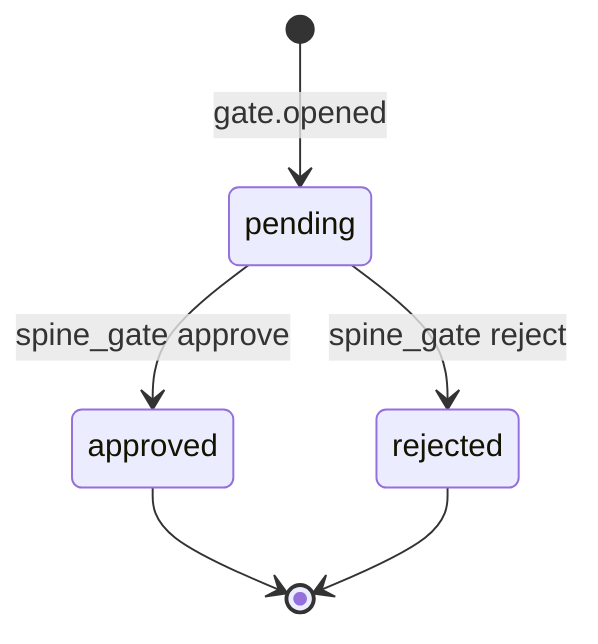
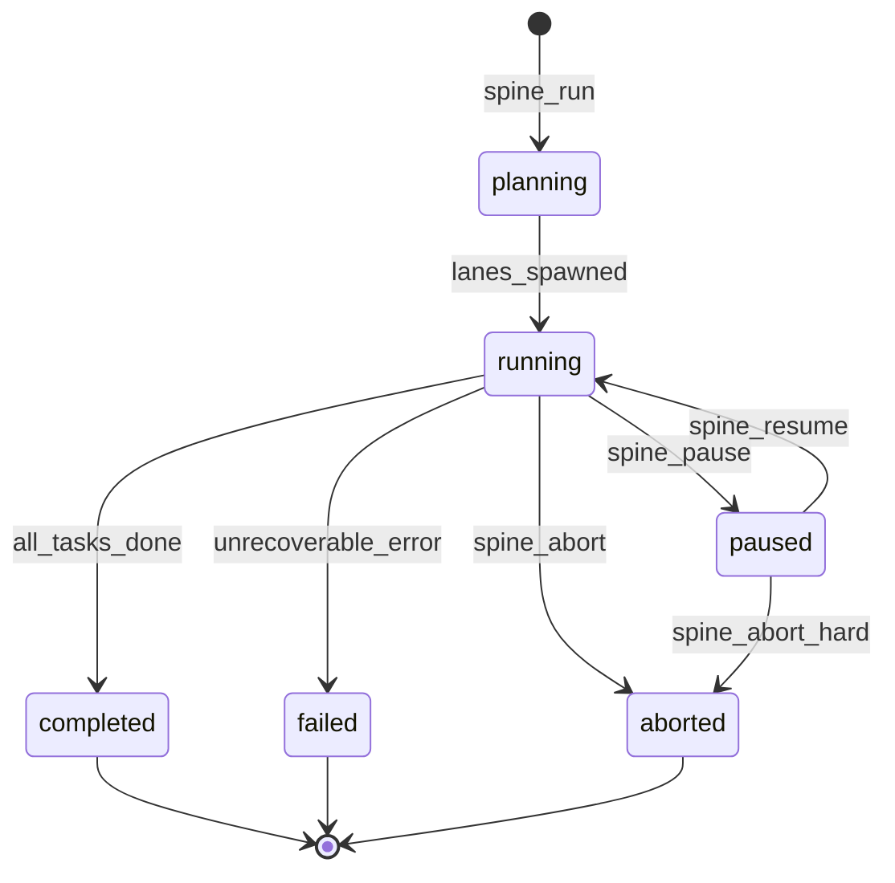
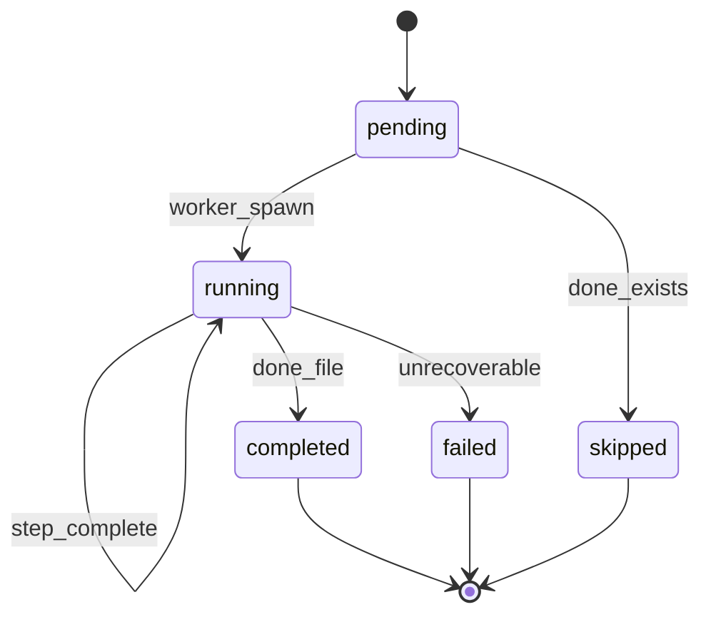

# pi-spine — Product Requirements Document (PRD)

**Document type:** Product Requirements Document (greenfield repo handoff)  
**Product:** pi-spine  
**Version:** 1.2  
**Last updated:** 2026-06-01  
**Status:** Draft — ready for new repository  

**Primary reference for:** All implementation work in the `pi-spine` repository  
**Compatibility target:** [Taskplane task format](https://github.com/HenryLach/taskplane/blob/main/docs/reference/task-format.md) (read-only; no runtime dependency)

---

## Table of contents

1. [Executive summary](#1-executive-summary)
2. [Product naming](#2-product-naming)
3. [Background and rationale](#3-background-and-rationale)
4. [Goals, non-goals, and success metrics](#4-goals-non-goals-and-success-metrics)
5. [Target platform and technical constraints](#5-target-platform-and-technical-constraints)
6. [User personas and user stories](#6-user-personas-and-user-stories)
7. [Functional requirements](#7-functional-requirements)
8. [Non-functional requirements](#8-non-functional-requirements)
9. [System architecture](#9-system-architecture)
10. [Data model and persistence](#10-data-model-and-persistence)
11. [Orchestration journal specification](#11-orchestration-journal-specification)
12. [Human gates specification](#12-human-gates-specification)
13. [Taskplane compatibility specification](#13-taskplane-compatibility-specification)
14. [Agent contracts and prompts](#14-agent-contracts-and-prompts)
15. [CLI and pi slash commands](#15-cli-and-pi-slash-commands)
16. [Dashboard specification](#16-dashboard-specification)
17. [Batch lifecycle and state machines](#17-batch-lifecycle-and-state-machines)
18. [Error handling, recovery, and resilience](#18-error-handling-recovery-and-resilience)
19. [Security and privacy](#19-security-and-privacy)
20. [Testing and verification](#20-testing-and-verification)
21. [Repository layout and conventions](#21-repository-layout-and-conventions)
22. [Migration from Taskplane](#22-migration-from-taskplane)
23. [Implementation phases](#23-implementation-phases)
24. [Risks and mitigations](#24-risks-and-mitigations)
25. [Roadmap (post-v1)](#25-roadmap-post-v1)
26. [Appendices](#26-appendices)

---

## 1. Executive summary

**pi-spine** is a **pi-native orchestration package** for long-running, multi-task software development. It composes the strongest ideas from three existing orchestration systems without reimplementing them wholesale:

| Source | Adopted patterns | Explicitly not forked |
|--------|------------------|-------------------------|
| [Taskplane](https://pi.dev/packages/taskplane) | `PROMPT.md` / `STATUS.md` task packets, dependency waves, git worktree lanes, cross-model review, orch-branch integration | Supervisor mail, polyrepo segment DAG, merger LLM agent |
| [Babysitter](https://github.com/a5c-ai/babysitter) | Append-only orchestration journal; deterministic replay of **control-plane** events; fail-closed integrate | JS process-definition engine; cross-harness routing; `run:iterate` driver |
| [pi-conductor](https://registry.npmjs.org/@feniix/pi-conductor) | Human gates with evidence bundles; PR-readiness checks; agent-native tool surface (v1.1+) | External control-plane database; full objective scheduler |

**v1 scope (locked):**

- **Host:** pi coding agent only (`pi install npm:pi-spine`)
- **Task format:** Taskplane-compatible packets (no format migration required)
- **Repo mode:** Monorepo batches with lane-level worktree isolation
- **Distribution:** npm package + pi.dev listing when stable

**Tagline:** *Orchestration spine for long-running pi development.*

**Product intent:** pi-spine is not only a batch runner — it is a **batch interpreter** that always answers: *what state am I in, and what single command should I run next?*

**Primary user (v1):** Solo developer running parallel agent work on production codebases who needs durable task memory, auditable batch history, explicit human approval before integration, and recoverability when lanes crash — without maintaining three separate orchestrators.

---

## 2. Product naming

### 2.1 Chosen name: **pi-spine**

| Attribute | Value |
|-----------|-------|
| npm package | `pi-spine` |
| CLI binary | `spine` |
| Pi slash prefix | `/spine`, `/spine-plan`, `/spine-status`, … |
| Runtime directory | `.spine/` (consumer repo, gitignored artifacts) |
| Default tasks root | `spine-tasks/` (or `--tasks-root taskplane-tasks` for migration) |

### 2.2 Naming rationale

| Criterion | pi-spine |
|-----------|----------|
| Metaphor | Structural backbone — journal, planner, gates, and worktrees attach to a thin spine |
| pi.dev convention | Short, lowercase, pi-prefixed (like `taskplane`, `pi-subagents`) |
| Scope signal | Implies composition, not replacement of upstream tools |
| Collision risk | Low vs `pi-conductor`, `taskplane`, `@a5c-ai/babysitter-pi` |

### 2.3 Alternatives (fallback if npm name taken)

| Name | Pros | Cons |
|------|------|------|
| **pi-baton** | Strong conducting metaphor | Less descriptive of journal + gates |
| **pi-keel** | Durability / stability metaphor | Nautical; less intuitive for new users |
| **pi-gatehouse** | Emphasizes human gates | Undersells batch + journal story |
| **@cdelgado/pi-spine** | Scoped npm namespace | Harder pi.dev discovery |

### 2.4 Naming decision record

**Rejected:** `pi-compose` (too generic), `pi-taskplane-fork` (confusing), `pi-orchestrator` (overbroad), `acme-spine` (too project-specific for a published package).

---

## 3. Background and rationale

### 3.1 Problem statement

Long-running agent-driven development fails repeatedly for the same structural reasons:

1. **Context loss** — LLM sessions compact or crash; work-in-progress state disappears.
2. **Parallel collision** — multiple agents edit the same checkout and overwrite each other.
3. **Opaque recovery** — batch orchestrators pause with unclear lane health; operators cannot tell whether to resume, force-resume, or abort.
4. **Premature integration** — completed lane work merges to main without explicit human review or test evidence.
5. **Tool fragmentation** — Taskplane, Babysitter, and pi-conductor each solve subsets well but use incompatible state ownership models.

Real-world example (2026-05-29): A Taskplane batch ran 3 lanes across 11 tasks; supervisor reported partial lane coverage (1/3 workers confirmed alive), resume blocked while batch marked executing, and phase mismatch during resume transition.

Real-world example (2026-05-31, pi-spine Phase 0 dogfood): A four-lane Taskplane batch on this repo completed 3/4 tasks. **TP-002 failed on a 60-minute stall kill despite passing tests** — the worker had uncommitted valid work but had not updated STATUS or created `.DONE`. Recovery then failed repeatedly: `orch_retry_task` reset the task record but **not** the segment frontier, so resume skipped re-execution (`pendingSegments=0`) and started merging other lanes; abort deleted `.pi/batch-state.json`; manual JSON repair was required to re-spawn lane-1. Full post-mortem: [`docs/incidents/20260531-phase0-taskplane-batch.md`](docs/incidents/20260531-phase0-taskplane-batch.md).

After manual recovery and git merge to `main`, the Taskplane UI still showed **red "stopped"** with all tasks green and prompted to pause — batch merge/completion was never recorded (`mergeResults` empty, `endedAt` null). pi-spine Phase 1b adds reconciliation so operators get `spine batch dismiss` or `complete` instead of debugging orchestrator internals.

pi-spine exists to reduce recurrence of this class of failure through **journal-backed reconciliation**, **batch diagnosis UX**, **atomic retry/resume**, **progress-aware stall detection**, **explicit gates**, and **Taskplane-compatible task packets** the operator already authors.

### 3.2 Design philosophy: compose, don't merge

pi-spine is **Tier A/B** on the complexity spectrum — not a Tier C unified engine that reimplements three products.

| Principle | Meaning |
|-----------|---------|
| **Compose** | One thin orchestration loop; adopt patterns; optional deps on battle-tested libraries |
| **Boundary journaling** | Journal records orchestration events (task start, gate, lane death), not every LLM token |
| **Fail closed** | Integrate, resume-after-corruption, and gate bypass all require explicit operator action |
| **Act, don't explain internals** | Every ambiguous batch state resolves to a named `diagnosis` plus executable next step — never "figure out segment frontier yourself" |
| **Never orphan active batch** | When work is on `baseBranch` or the batch is terminal, pi-spine archives and clears active state; operators never hand-edit batch-state JSON |
| **Compat first** | Taskplane packet format is the v1 task contract; native format deferred |
| **pi-native** | Extension + skill + CLI; no cross-harness v1 scope |

### 3.3 Competitive positioning

```text
                    Durability / audit
                           ▲
                           │
              Babysitter   │   pi-spine (target)
              (journal)    │   (journal + packets + gates)
                           │
         ──────────────────┼──────────────────► Batch / parallel
                           │                    orchestration
              pi-conductor │   Taskplane
              (gates)      │   (waves + dashboard)
                           │
```

pi-spine occupies the **upper-right intent space**: batch orchestration with strong audit trail and human gates, using Taskplane-compatible authoring.

### 3.4 Relationship to upstream tools

| Tool | Relationship |
|------|--------------|
| Taskplane | **Format compatibility target.** pi-spine reads the same folders; Taskplane not required at runtime. |
| Babysitter | **Pattern inspiration** for journal schema. No SDK dependency in v1. |
| pi-conductor | **Pattern inspiration** for gates and evidence. No package dependency in v1. |
| pi-subagents | **Optional execution backend** in v1.1 for in-lane parallel fanout. |
| `@feniix/worktrees-core` | **Candidate dependency** for worktree lifecycle (evaluate license + API stability). |

---

## 4. Goals, non-goals, and success metrics

### 4.1 Goals (v1)

| ID | Goal |
|----|------|
| G1 | Run batches from Taskplane-format `PROMPT.md`, `STATUS.md`, and `dependencies.json` without modification |
| G2 | Schedule tasks in dependency waves with parallel lane execution and git worktree isolation |
| G3 | Workers follow STATUS-first checkpoint discipline with step-boundary git commits |
| G4 | Maintain append-only orchestration journal rebuildable into batch timeline |
| G5 | Block integration until human gate approval with evidence bundle |
| G6 | Support cross-model review (worker model ≠ reviewer model) at step boundaries |
| G7 | Ship as installable pi package: `pi install npm:pi-spine` |
| G8 | Provide local status dashboard (SSE) for batch, lane, and gate visibility |
| G9 | Reconcile batch state from tasks, git, and registry — surface one headline and `suggestedCommand` without orchestrator literacy |

### 4.2 Non-goals (v1)

- Cross-harness routing (Cursor, Codex, Gemini CLI, Babysitter harness invoker)
- Polyrepo workspaces and segment-level dependency DAG
- Taskplane supervisor mail system and conversational supervisor autonomy
- Deterministic replay of LLM outputs or tool-call streams
- Cloud-hosted control plane or multi-machine coordination
- LLM-powered merger agent for git conflict resolution
- Babysitter process definitions (`ctx.task`, `ctx.parallel.all` in JS)
- Cursor extension or Babysitter pi plugin equivalent
- Authoring wizard that replaces Taskplane's `create-taskplane-tasks` skill (optional v1.1 skill only)

### 4.3 Success metrics

| ID | Metric | Verification method |
|----|--------|---------------------|
| M1 | Fresh init passes doctor | `spine init && spine doctor` all green |
| M2 | Three independent tasks run in parallel lanes without file collision | Integration test + manual 3-lane batch |
| M3 | Mid-batch kill + resume completes remaining tasks without duplicate work | Kill -9 engine; `/spine-resume` |
| M4 | Integrate rejected without gate approval | `/spine-integrate` → exit non-zero + message |
| M5 | Wave plan matches Taskplane shape on same dependencies | Diff `/spine-plan all` vs `/orch-plan all` on same deps |
| M6 | pi package loads slash commands | `pi install npm:pi-spine`; `/spine` visible |
| M7 | Journal replay produces readable post-mortem | `spine journal replay --batch {id}` after forced lane death |
| M8 | Single-task retry re-executes without hand-editing state | Kill lane mid-task; `/spine-retry-task TP-002`; resume; verify `pendingSegments=1` equivalent |
| M9 | Abort preserves recoverable batch snapshot | `/spine-abort`; force-resume rebuilds segment topology without operator JSON surgery |
| M10 | Known limbo states resolved with one `spine` command — no JSON surgery | All tasks succeeded + stale batch phase → `spine batch dismiss` or `complete` |
| M11 | Preflight blocks new batch when stale active batch exists | `spine preflight` prints dismiss/complete suggestion |

---

## 5. Target platform and technical constraints

### 5.1 Runtime requirements

| Attribute | Value |
|-----------|-------|
| Node.js | ≥ 22 |
| pi coding agent | Required ([pi docs](https://pi.dev/docs/latest)) |
| Git | ≥ 2.30; worktree support required |
| OS | macOS and Linux (primary); Windows best-effort |
| TypeScript | 5.x; ESM modules |
| License | MIT (recommended) |

### 5.2 Pi SDK dependencies (peer)

| API | Usage |
|-----|-------|
| `createAgentSession` | Lane worker and reviewer child sessions |
| `SessionManager` | Persist/resume worker sessions across invocations |
| `DefaultResourceLoader` | Load project skills/rules into worker context |
| Custom tools | `spine_review_step`, `spine_report_progress`, `spine_request_gate` |
| Extension registration | Slash commands, tool injection |

Pin peer dependency range; `spine doctor` warns on unsupported pi versions.

### 5.3 Repository prerequisites (consumer project)

- Git repository initialized
- Clean working tree at batch start (uncommitted changes fail fast with path list)
- Configured model provider in pi (`/login` or env API keys)
- Tasks root with at least one valid packet (for batch run)

### 5.4 iOS / Xcode projects (consumer note)

iOS / Xcode consumer repos require explicit `testing.build` and `testing.test` commands in config (xcodebuild destinations). pi-spine does not manage Xcode DerivedData across worktrees; document `worktreeSetupHook` for symlink/copy strategies. Single-lane mode (`lanes.maxParallel: 1`) is supported for heavy native projects.

---

## 6. User personas and user stories

### 6.1 Personas

| Persona | Description | Primary needs |
|---------|-------------|---------------|
| **P1 — Solo builder** | One developer, pi power user, multi-day agent batches | Resume, audit, gates |
| **P2 — Migrator** | Existing Taskplane task folders | Zero packet rewrite |
| **P3 — Package author** | Publishes pi-spine to npm/pi.dev | Clean API, doctor, docs |

### 6.2 User stories with acceptance criteria

#### US-1: Plan before spend

**As** a pi user, **I want** `/spine-plan all`, **so that** I see waves, lanes, and blocked tasks before launching agents.

| AC | Criterion |
|----|-----------|
| AC-1.1 | Output lists wave index, task IDs per wave, lane assignment |
| AC-1.2 | Cycle in dependencies → non-zero exit + cycle path printed |
| AC-1.3 | File-scope overlap forces serial lane assignment or warning |

#### US-2: Parallel isolated execution

**As** a pi user, **I want** `/spine all`, **so that** independent tasks run in parallel worktrees.

| AC | Criterion |
|----|-----------|
| AC-2.1 | Each lane has distinct worktree path and branch |
| AC-2.2 | No lane reads/writes parent checkout during execution |
| AC-2.3 | Orch branch created before lane merges |

#### US-3: Crash recovery

**As** a pi user, **I want** `/spine-resume`, **so that** a killed batch continues from last checkpoint.

| AC | Criterion |
|----|-----------|
| AC-3.1 | Completed tasks (`.DONE` present) not re-executed |
| AC-3.2 | In-progress task resumes from `STATUS.md` |
| AC-3.3 | Journal records `batch.resumed` with reason |

#### US-4: Human gate before integrate

**As** a pi user, **I want** `/spine-gate`, **so that** I approve test evidence before merging to main.

| AC | Criterion |
|----|-----------|
| AC-4.1 | Gate opens automatically when batch completes |
| AC-4.2 | Evidence includes test output path and diff stat |
| AC-4.3 | `/spine-integrate` fails if gate not `approved` |

#### US-5: Post-mortem debugging

**As** a pi user, **I want** journal replay, **so that** I understand lane death timelines.

| AC | Criterion |
|----|-----------|
| AC-5.1 | Timeline ordered by timestamp with event types and correlation IDs |

#### US-6: Taskplane migration

**As** a migrator, **I want** `--tasks-root taskplane-tasks`, **so that** existing packets work unchanged.

| AC | Criterion |
|----|-----------|
| AC-6.1 | `TP-*` folders discovered and planned |
| AC-6.2 | `dependencies.json` merged with PROMPT dependencies |

#### US-7: Always know what to do next

**As** a pi user, **I want** `/spine-status` (or `spine status`) to tell me the **real** batch situation, **so that** I never guess pause vs resume vs dismiss vs integrate.

| AC | Criterion |
|----|-----------|
| AC-7.1 | Output includes `diagnosis`, human `headline`, and `suggestedCommand` |
| AC-7.2 | When all tasks are terminal-success and git shows orch work on `baseBranch`, diagnosis is `completed_manual` or `needs_integrate` — **not** "pause batch" |
| AC-7.3 | CLI, slash command, and dashboard show the **same** reconciled diagnosis (NFR-OBS-04) |
| AC-7.4 | Limbo with no running lanes offers `spine batch dismiss` or `spine batch complete`, never bare `pause` |

---

## 7. Functional requirements

### 7.1 Project initialization (FR-INIT)

| ID | Requirement | P |
|----|-------------|---|
| FR-INIT-01 | `spine init` creates `.spine/spine-config.json` with defaults | 0 |
| FR-INIT-02 | `spine init` creates `.spine/agents/{worker,reviewer,supervisor}.md` composable stubs | 0 |
| FR-INIT-03 | `spine init` appends `.gitignore` entries: `.spine/runtime/`, `.worktrees/` | 0 |
| FR-INIT-04 | `spine init --tasks-root PATH` sets tasks root (default `spine-tasks/`) | 0 |
| FR-INIT-05 | `spine init --preset taskplane-compat` copies sensible defaults for Taskplane migrants | 1 |
| FR-INIT-06 | `spine doctor` validates Node, git, pi, tasks root, config schema, model provider | 0 |
| FR-INIT-07 | `spine config --save-as-defaults` writes preferences to `~/.pi/agent/spine/preferences.json` | 2 |

### 7.2 Task discovery and parsing (FR-TASK)

| ID | Requirement | P |
|----|-------------|---|
| FR-TASK-01 | Discover tasks: `{tasksRoot}/{PREFIX-###-slug}/PROMPT.md` | 0 |
| FR-TASK-02 | Parse heading `# Task: PREFIX-### — Name` (em dash required) | 0 |
| FR-TASK-03 | Parse sections: Mission, Dependencies, File Scope, Steps, Testing, Completion Criteria, Do NOT | 0 |
| FR-TASK-04 | Parse `STATUS.md` mirroring step numbers; checkboxes drive progress | 0 |
| FR-TASK-05 | Merge dependencies: PROMPT `## Dependencies` ∪ `dependencies.json`; JSON wins conflicts | 0 |
| FR-TASK-06 | Completion = `.DONE` file + all STATUS checkboxes checked + testing step verified | 0 |
| FR-TASK-07 | Skip tasks with existing `.DONE` when resuming unless `--force-task ID` | 0 |
| FR-TASK-08 | Read area `CONTEXT.md` for reference only (orchestrator does not mutate Next Task ID) | 1 |

### 7.3 Scheduling and planning (FR-SCHED)

| ID | Requirement | P |
|----|-------------|---|
| FR-SCHED-01 | Build directed graph from dependencies; topological sort into waves | 0 |
| FR-SCHED-02 | Detect cycles; print cycle path in error | 0 |
| FR-SCHED-03 | Assign tasks to lanes: minimize count subject to file-scope disjointness | 0 |
| FR-SCHED-04 | Respect `lanes.maxParallel` cap | 0 |
| FR-SCHED-05 | `/spine-plan` writes plan artifact to `.spine/runtime/plan-{timestamp}.json` | 1 |
| FR-SCHED-06 | Support plan scope: `all`, glob paths, explicit task IDs | 0 |

**File-scope overlap algorithm (normative):**

1. Normalize paths from `## File Scope` (glob expansion optional v1.1).
2. Two tasks overlap if any path prefix matches or explicit directory intersection.
3. Greedy lane assignment: for each task in wave order, place in first lane with no overlap; else open new lane.
4. If lane count > `maxParallel`, queue excess lanes for next scheduler tick within same wave (config: `lanes.queueExcess` default `true`).

### 7.4 Worktree isolation (FR-WT)

| ID | Requirement | P |
|----|-------------|---|
| FR-WT-01 | Create worktree per lane at `.worktrees/spine-{batchId}/lane-{n}` | 0 |
| FR-WT-02 | Branch name: `spine/{operator}-{batchId}/lane-{n}` | 0 |
| FR-WT-03 | Orch branch: `orch/spine-{operator}-{batchId}` from `baseBranch` | 0 |
| FR-WT-04 | Fail if working tree dirty; list up to 20 dirty paths | 0 |
| FR-WT-05 | `worktreeSetupHook` command in config; timeout 120s; JSON result required | 1 |
| FR-WT-06 | Cleanup worktrees on `--hard` abort; archive on soft abort | 0 |
| FR-WT-07 | Symlink `node_modules` when present in parent (Node projects) | 1 |

### 7.5 Worker execution (FR-WORK)

| ID | Requirement | P |
|----|-------------|---|
| FR-WORK-01 | Worker executes all incomplete steps in one session until done or context limit | 0 |
| FR-WORK-02 | STATUS.md updated before every step boundary commit | 0 |
| FR-WORK-03 | Git commit per completed step: `{taskId} step {n}: {step title}` | 0 |
| FR-WORK-04 | On context limit: persist STATUS, commit, exit 0; scheduler re-invokes worker | 0 |
| FR-WORK-05 | Worker receives tiered context: PROMPT, STATUS, config referenceDocs/standards | 0 |
| FR-WORK-06 | Worker must not edit files outside `## File Scope` without PROMPT amendment | 0 |
| FR-WORK-07 | Worker calls `spine_review_step` when review level > 0 | 0 |
| FR-WORK-08 | Project overrides compose with base prompt in `.spine/agents/worker.md` | 0 |
| FR-WORK-09 | Worker emits checkpoint heartbeat to journal every completed step (or every 10 min during long steps) | 3 |
| FR-WORK-10 | Monitor compares STATUS checkboxes to filesystem signals before stall kill (e.g. new files in File Scope) | 3 |

### 7.6 Review (FR-REV)

| ID | Requirement | P |
|----|-------------|---|
| FR-REV-01 | Reviewer session uses `agents.reviewer.model` when not `inherit` | 0 |
| FR-REV-02 | Verdicts: `APPROVE` \| `REVISE` (structured JSON) | 0 |
| FR-REV-03 | REVISE returns actionable feedback; worker addresses inline | 0 |
| FR-REV-04 | Review artifacts: `{taskFolder}/.reviews/{step}-{timestamp}.md` | 0 |
| FR-REV-05 | Review levels 0–3 per Taskplane rubric (see Appendix C) | 0 |
| FR-REV-06 | When review level > 0 and review spawn fails, worker stops (fail closed); journal `review.failed` | 4 |

### 7.7 Orchestration journal (FR-JRN)

See [§11](#11-orchestration-journal-specification).

### 7.8 Human gates (FR-GATE)

See [§12](#12-human-gates-specification).

### 7.9 Batch lifecycle (FR-BATCH)

| ID | Requirement | P |
|----|-------------|---|
| FR-BATCH-01 | Batch ID format: `{YYYYMMDD}T{HHmmss}` UTC | 0 |
| FR-BATCH-02 | Phases: `planning`, `running`, `paused`, `completed`, `failed`, `aborted` (engine may also use `stopped`, `merging`, `executing`; **operator-facing** state is always `diagnosis` per FR-BATCH-13) | 0 |
| FR-BATCH-03 | Only one active batch per repo (second start fails with active batchId) | 0 |
| FR-BATCH-04 | `/spine-pause` stops scheduling new tasks; in-flight tasks finish | 0 |
| FR-BATCH-05 | `/spine-resume` continues paused batch; `--force` reconciles stale lane state | 0 |
| FR-BATCH-06 | `/spine-abort` graceful default; `--hard` kills lane sessions; **always** archives batch snapshot to `.spine/runtime/{batchId}/archive/batch-state.json` before clearing active state | 0 |
| FR-BATCH-07 | Lane heartbeat: update every 60s; stale after 180s without heartbeat | 0 |
| FR-BATCH-08 | On batch completion, collect lane branches into orch branch (sequential merge v1) | 0 |
| FR-BATCH-09 | `/spine-retry-task ID` atomically resets task record, all segment records, counters, and lane allocation | 3 |
| FR-BATCH-10 | Wave merge blocked while any wave task is `failed` or `pending` unless operator `/spine-skip-task` or `/spine-force-merge` | 3 |
| FR-BATCH-11 | Batch preflight before start: doctor green, tasks committed, no active batch (or stale batch reconciled), wave plan printed | 0 |
| FR-BATCH-12 | **Batch reconciliation:** on every status read, derive `diagnosis` from task records, segment frontier, merge results, journal tail, git (`orchBranch` vs `baseBranch`), lane registry, and `.DONE` files — not from `phase` alone | 1 |
| FR-BATCH-13 | **Diagnosis taxonomy:** `running`, `paused`, `needs_retry`, `needs_merge`, `needs_integrate`, `completed`, `completed_manual`, `limbo_stale`, `failed`, `aborted` | 1 |
| FR-BATCH-14 | **`spine status [--diagnose]`** and **`/spine-status`:** JSON + human output with `suggestedCommand` and optional `alternatives[]` per §18.3 | 1 |
| FR-BATCH-15 | **`spine batch dismiss` / `/spine-dismiss`:** archive active batch snapshot, clear active state, journal `batch.dismissed` — for limbo or abandoned Taskplane batches | 1 |
| FR-BATCH-16 | **`spine batch complete`:** when reconciliation says all work terminal + merge satisfied, mark `completed`, move to history | 1 |
| FR-BATCH-17 | **Extend FR-BATCH-11 preflight:** if active/stale batch detected, run reconciliation; block start with dismiss/complete suggestion (not generic "batch already running") | 1 |
| FR-BATCH-18 | **`/spine` entry command:** detect project + batch diagnosis; offer the **single best** next action (plan / run / resume / retry / dismiss / integrate) | 1 |
| FR-BATCH-19 | **Zombie registry cleanup:** if batch phase is terminal but lane workers registered as running, reconcile registry before showing "pause" | 2 |

### 7.10 Integration (FR-INT)

| ID | Requirement | P |
|----|-------------|---|
| FR-INT-01 | `/spine-integrate` merges `orchBranch` → `baseBranch` locally | 0 |
| FR-INT-02 | Integrate requires gate `approved` when `gates.requireBeforeIntegrate` true | 0 |
| FR-INT-03 | Merge conflict → abort integrate, open `manual` gate, journal `integrate.failed` | 0 |
| FR-INT-04 | Does not auto-push remote | 0 |
| FR-INT-05 | Optional `--dry-run` prints merge plan only | 1 |

### 7.11 Configuration (FR-CFG)

| ID | Requirement | P |
|----|-------------|---|
| FR-CFG-01 | Schema version field `configVersion: 1` | 0 |
| FR-CFG-02 | See [§10.4](#104-spine-configjson-schema) for full schema | 0 |
| FR-CFG-03 | `/spine-settings` TUI for model/thinking/lanes/gates | 1 |
| FR-CFG-04 | Environment variable overrides: `SPINE_TASKS_ROOT`, `SPINE_MAX_LANES` | 2 |

---

## 8. Non-functional requirements

| ID | Category | Requirement |
|----|----------|-------------|
| NFR-REL-01 | Reliability | Idempotent task start: `.DONE` + journal `task.completed` both consulted |
| NFR-REL-02 | Reliability | Batch state rebuildable from journal + filesystem in <5s for 50 tasks |
| NFR-REL-03 | Reliability | No silent lane death: stale lanes surface in `/spine-status` within 180s |
| NFR-REL-04 | Reliability | Abort never leaves repo without recoverable batch snapshot (journal + archived state) |
| NFR-SEC-01 | Security | Never persist API keys, tokens, or `.env` contents in journal/evidence |
| NFR-SEC-02 | Security | Redact `*_KEY`, `*_TOKEN`, `*SECRET*` from evidence bundles |
| NFR-SEC-03 | Security | pi-spine package review before pi.dev publish (no arbitrary shell from config without explicit opt-in) |
| NFR-PERF-01 | Performance | Planner <2s for 100 tasks on M-series Mac |
| NFR-PERF-02 | Performance | Journal append O(1); no full file rewrite per event |
| NFR-OBS-01 | Observability | Structured logs: `{ batchId, laneId, taskId, event }` |
| NFR-OBS-02 | Observability | Dashboard SSE latency <500ms for status updates |
| NFR-OBS-03 | Observability | Post-mortem summary must list failures, suggested recovery commands, and never claim success when `failedTasks > 0` |
| NFR-OBS-04 | Observability | CLI, slash, dashboard, and MCP-style status must share one reconciliation implementation — no drift |
| NFR-OBS-05 | Observability | Operator never needs to read segment frontier unless running `spine status --verbose` |
| NFR-UX-01 | UX | Every error includes `suggestedCommand` field |
| NFR-TEST-01 | Testing | ≥80% unit coverage on planner, journal, gate FSM |
| NFR-TEST-02 | Testing | Integration fixture repo in CI |
| NFR-MAINT-01 | Maintainability | Taskplane compat tests pinned to reference doc URLs |

---

## 9. System architecture

### 9.1 High-level component diagram



### 9.2 Control plane vs execution plane

| Plane | Owns | Does not own |
|-------|------|--------------|
| **Control** | Waves, lanes, journal, gates, batch phase | LLM conversation content |
| **Execution** | Worker/reviewer sessions, git commits in worktree | Cross-lane scheduling |

Journal is **control-plane** source of truth. `batch-state.json` is a cache.

### 9.3 Package layout (pi-spine repository)

```text
pi-spine/
├── package.json                 # pi manifest + bin
├── extensions/
│   └── spine-orchestrator.ts
├── skills/
│   ├── spine-orchestration/
│   └── create-spine-tasks/      # optional v1.1
├── src/
│   ├── cli/
│   ├── planner/
│   ├── runtime/
│   ├── journal/
│   ├── gates/
│   ├── worktrees/
│   ├── agents/                  # base prompts shipped
│   ├── tasks/packet/
│   └── dashboard/
├── templates/                   # spine init templates
├── docs/
│   └── PRD.md                   # copy of this document
└── test/
    ├── unit/
    └── fixture-repo/
```

### 9.4 Consumer repository layout

```text
{repo}/
├── .spine/
│   ├── spine-config.json
│   ├── batch-state.json
│   ├── batch-history.json
│   ├── agents/                  # project overrides
│   └── runtime/{batchId}/
│       ├── journal/events.jsonl
│       ├── lanes/lane-{n}.json
│       ├── gates.json
│       ├── evidence/
│       └── registry.json
├── .worktrees/spine-{batchId}/
│   ├── lane-1/
│   ├── lane-2/
│   └── lane-3/
└── {tasksRoot}/                 # e.g. taskplane-tasks/
    ├── dependencies.json
    ├── CONTEXT.md
    └── TP-001-slug/
        ├── PROMPT.md
        └── STATUS.md
```

---

## 10. Data model and persistence

### 10.1 Batch state (cache) — schema version 1

```typescript
interface BatchState {
  schemaVersion: 1;
  phase: "planning" | "running" | "paused" | "completed" | "failed" | "aborted";
  batchId: string;
  baseBranch: string;
  orchBranch: string;
  startedAt: number;       // epoch ms
  updatedAt: number;
  endedAt: number | null;
  currentWaveIndex: number;
  totalWaves: number;
  wavePlan: string[][];      // task IDs per wave
  lanes: LaneRecord[];
  tasks: TaskRecord[];
  mergeResults: MergeResult[];
  totalTasks: number;
  succeededTasks: number;
  failedTasks: number;
  skippedTasks: number;
  blockedTasks: number;
  blockedTaskIds: string[];
  lastError: string | null;
  resilience: {
    resumeForced: boolean;
    retryCountByScope: Record<string, number>;
    lastFailureClass: string | null;
    repairHistory: RepairEntry[];
  };
}

interface LaneRecord {
  laneNumber: number;
  laneId: string;
  laneSessionId: string;
  worktreePath: string;
  branch: string;
  taskIds: string[];
  lastHeartbeatAt?: number;
  status: "pending" | "running" | "stale" | "completed" | "failed";
}

interface TaskRecord {
  taskId: string;
  laneNumber: number;
  sessionName: string;
  status: "pending" | "running" | "completed" | "failed" | "skipped";
  taskFolder: string;
  startedAt: number | null;
  endedAt: number | null;
  doneFileFound: boolean;
  exitReason: string;
}
```

### 10.2 Journal event — schema version 1

```typescript
interface SpineEvent {
  schemaVersion: 1;
  eventId: string;           // ULID or uuid v7
  type: SpineEventType;
  timestamp: string;         // ISO-8601 UTC
  batchId: string;
  correlationId?: string;    // ties lane/task events
  laneId?: string;
  taskId?: string;
  payload: Record<string, unknown>;
}

type SpineEventType =
  | "batch.started"
  | "batch.paused"
  | "batch.resumed"
  | "batch.completed"
  | "batch.failed"
  | "batch.aborted"
  | "wave.started"
  | "wave.completed"
  | "lane.spawned"
  | "lane.heartbeat"
  | "lane.stale"
  | "lane.died"
  | "lane.completed"
  | "task.started"
  | "task.step_completed"
  | "task.completed"
  | "task.failed"
  | "review.requested"
  | "review.completed"
  | "gate.opened"
  | "gate.resolved"
  | "integrate.started"
  | "integrate.completed"
  | "integrate.failed";
```

### 10.3 Gate record

```typescript
interface SpineGate {
  gateId: string;
  batchId: string;
  kind: "integrate" | "manual" | "conflict";
  status: "pending" | "approved" | "rejected";
  openedAt: string;
  evidenceRefs: string[];
  summary: string;
  decidedAt?: string;
  decidedBy?: "human" | "auto";
  rejectionReason?: string;
}
```

### 10.4 spine-config.json schema

```json
{
  "configVersion": 1,
  "project": {
    "name": "my-project",
    "description": ""
  },
  "paths": {
    "tasksRoot": "taskplane-tasks"
  },
  "baseBranch": "main",
  "testing": {
    "build": "",
    "test": "",
    "testWithCoverage": ""
  },
  "agents": {
    "worker": { "model": "inherit", "thinking": "high" },
    "reviewer": { "model": "inherit", "thinking": "medium" },
    "supervisor": { "model": "inherit", "thinking": "off" }
  },
  "lanes": {
    "maxParallel": 3,
    "queueExcess": true
  },
  "gates": {
    "requireBeforeIntegrate": true,
    "collectBuildEvidence": true,
    "collectTestEvidence": true
  },
  "worktreeSetupHook": "",
  "referenceDocs": [],
  "standards": [],
  "neverLoad": []
}
```

---

## 11. Orchestration journal specification

### 11.1 Purpose

Provide Babysitter-inspired **auditability** without adopting Babysitter's full replay engine. The journal answers: *What happened, in what order, and can I reconstruct batch timeline after lane death?*

### 11.2 Storage

- Path: `.spine/runtime/{batchId}/journal/events.jsonl`
- Format: one JSON object per line, append-only
- Rotation: none in v1; batch history archived on completion to `.spine/batch-history.json`

### 11.3 Write rules

| Rule | Detail |
|------|--------|
| W1 | Every batch phase transition writes exactly one event |
| W2 | Lane spawn/die always paired with `correlationId` |
| W3 | Payload max 32KB per event; large outputs stored as evidence file refs |
| W4 | No secrets in payload (enforced by redaction filter) |
| W5 | Writes fsync before acknowledging scheduler transition |

### 11.4 Replay (v1 scope)

`spine journal replay --batch {id}`:

1. Read all events in timestamp order.
2. Print human table: time | type | lane | task | summary.
3. Optionally `--format json` for tooling.

**Not in v1:** Rebuild batch-state purely from journal (v1.1); deterministic re-execution of agent work.

### 11.5 Comparison to Babysitter journal

| Aspect | Babysitter | pi-spine |
|--------|------------|----------|
| Granularity | Process steps + task effects | Orchestration boundaries |
| Replay | Full state reconstruction | Timeline + cache rebuild (v1.1) |
| Driver | `run:iterate` loop | pi batch engine |
| Determinism | Required for process JS | Required for control events only |

---

## 12. Human gates specification

### 12.1 Gate kinds

| Kind | Trigger | Operator action |
|------|---------|-----------------|
| `integrate` | Batch `completed` | approve / reject merge to base |
| `manual` | Operator `/spine-gate open` | approve / reject |
| `conflict` | Integrate merge conflict | approve manual resolution / reject |

### 12.2 Evidence bundle (integrate gate)

Collected to `.spine/runtime/{batchId}/evidence/`:

| Artifact | Source | Required |
|----------|--------|----------|
| `summary.md` | Engine-generated task scorecard | Yes |
| `diff-stat.txt` | `git diff --stat base..orchBranch` | Yes |
| `test-output.txt` | `testing.test` command | If configured |
| `build-output.txt` | `testing.build` command | If `collectBuildEvidence` |
| `coverage-output.txt` | `testing.testWithCoverage` | Optional |

### 12.3 Gate state machine



### 12.4 Fail-closed rules

- `/spine-integrate` with gate not `approved` → exit code 2
- Bypass flag `--force-integrate` requires `SPINE_ALLOW_FORCE=1` env (discouraged; logged to journal)

---

## 13. Taskplane compatibility specification

### 13.1 Supported Taskplane artifacts

| Artifact | Support level |
|----------|---------------|
| `PROMPT.md` | Full read; immutable above `---` divider |
| `STATUS.md` | Full read/write by worker |
| `dependencies.json` | Full read; merge with PROMPT deps |
| `CONTEXT.md` | Read-only |
| `.DONE` | Worker creates on completion |
| `.reviews/` | Worker/reviewer create at runtime |
| `.pi/taskplane-config.json` | Migration source only (not read at runtime) |

### 13.2 Unsupported Taskplane features (v1)

| Feature | pi-spine v1 behavior |
|---------|---------------------|
| Supervisor mail | Not implemented; use journal + dashboard |
| Merger agent | Sequential git merge; human on conflict |
| Polyrepo segments | Monorepo only; error if segment headers detected |
| Segment DAG in PROMPT | Warn and ignore |
| `/orch-deps` polyrepo view | Monorepo deps only |

### 13.3 Dependency merge algorithm

```
deps(task) = parse_prompt_deps(task) ∪ dependencies.json[task]
if conflict on same predecessor with different ID sets → JSON wins
```

### 13.4 PROMPT heading regex

```regex
^# Task: ([A-Z][A-Z0-9]*-\d+) — (.+)$
```

### 13.5 Compatibility test suite (required)

Pin conformance tests against:

- https://github.com/HenryLach/taskplane/blob/main/docs/reference/task-format.md
- https://github.com/HenryLach/taskplane/blob/main/docs/reference/status-format.md

Golden fixtures: 3 sample packets (S/M/L complexity) in `test/fixtures/taskplane/`.

---

## 14. Agent contracts and prompts

### 14.1 Agent roles (v1)

| Agent | Model config | Session type | Tools |
|-------|--------------|--------------|-------|
| Worker | `agents.worker` | Persistent per lane task | read, write, edit, bash, grep + spine child tools |
| Reviewer | `agents.reviewer` | Ephemeral per review | read, grep, bash (tests) |
| Supervisor | `agents.supervisor` | Light monitor (optional v1.1) | read, orch status tools only |

### 14.2 Worker standing orders (normative summary)

1. Read `STATUS.md` before any work; treat as authoritative progress.
2. Execute next incomplete step from `PROMPT.md`; one step at a time.
3. After each step: update STATUS checkboxes, commit, call `spine_review_step` if level > 0.
4. On context pressure: flush STATUS, commit partial step if needed, exit cleanly.
5. On completion: run testing step command, create `.DONE`, report via `spine_report_progress`.
6. Never edit files outside File Scope.
7. Never skip verification steps to claim done.

### 14.3 Reviewer standing orders

1. Receive step diff summary + File Scope + review level rubric.
2. Return JSON: `{ "verdict": "APPROVE"|"REVISE", "feedback": "..." }`.
3. REVISE must cite specific files/lines or missing tests.

### 14.4 Composable project overrides

Project files in `.spine/agents/worker.md` append after base prompt (same pattern as Taskplane `.pi/agents/task-worker.md` composition).

Frontmatter overrides:

```yaml
---
name: worker
# model: anthropic/claude-sonnet-4
# standalone: true   # replaces base entirely
---
```

### 14.5 Custom tools (worker runtime)

| Tool | Purpose |
|------|---------|
| `spine_review_step` | Spawn reviewer for current step |
| `spine_report_progress` | Emit structured progress to journal |
| `spine_request_gate` | Request manual gate (rare; integrate gate is automatic) |

---

## 15. CLI and pi slash commands

### 15.1 Pi slash commands

| Command | Description |
|---------|-------------|
| `/spine` | Detect project state; guide or offer batch — **route to best next action** from reconciliation (FR-BATCH-18) |
| `/spine-plan <all\|paths>` | Preview waves and lanes |
| `/spine <all\|paths>` | Execute batch |
| `/spine-status` | **Reconciled** batch diagnosis + lane health (not raw `phase`) |
| `/spine-pause` | Pause after current tasks |
| `/spine-resume [--force]` | Resume paused/failed batch |
| `/spine-abort [--hard]` | Abort batch |
| `/spine-retry-task <taskId>` | Reset one failed task for re-execution (atomic segment retry) |
| `/spine-skip-task <taskId>` | Skip failed task and unblock dependents |
| `/spine-dismiss [--reason]` | Archive and clear limbo/stale active batch (FR-BATCH-15) |
| `/spine-next` | Print or execute `suggestedCommand` for current diagnosis |
| `/spine-gate [approve\|reject]` | Gate inspection and resolution |
| `/spine-integrate [--dry-run]` | Merge orch branch (gate required) |
| `/spine-settings` | Interactive configuration |
| `/spine-deps <all\|paths>` | Show dependency graph |

### 15.2 CLI commands

| Command | Description |
|---------|-------------|
| `spine init [options]` | Scaffold project |
| `spine doctor` | Validate installation |
| `spine plan <scope>` | Plan only (JSON to stdout with `--json`) |
| `spine run <scope>` | Execute batch (non-pi automation) |
| `spine status [--diagnose] [--json]` | Reconciled batch diagnosis + lane health |
| `spine batch dismiss [--batch ID] [--reason]` | Archive and clear limbo/stale active batch |
| `spine batch complete [--batch ID]` | Finalize batch when reconciliation says work is done |
| `spine next` | Print or execute `suggestedCommand` for current diagnosis |
| `spine dashboard` | Start SSE dashboard (default port 8109) |
| `spine journal replay --batch ID` | Timeline replay |
| `spine migrate-from-taskplane` | Config migration helper |
| `spine version` | Version info |

Default dashboard port **8109** (avoid Taskplane 8099 collision when both installed).

---

## 16. Dashboard specification

### 16.1 v1 scope (minimal viable)

- URL: `http://localhost:8109`
- Transport: SSE
- Panels: batch summary, **diagnosis banner** (headline + primary action), wave progress, lane table, active gate, last 20 journal events
- Diagnosis banner primary actions: `Dismiss`, `Complete`, `Integrate`, `Retry`, `Resume` — badge color from **`diagnosis`**, not raw `phase`

### 16.2 Lane table columns

| Column | Source |
|--------|--------|
| Lane | laneId |
| Status | running / stale / completed |
| Tasks | task ID list |
| Heartbeat | age seconds |
| Worktree | path (truncated) |

### 16.3 Non-goals (dashboard v1)

- Full Taskplane dashboard parity
- Remote access / auth
- Historical batch analytics

---

## 17. Batch lifecycle and state machines

### 17.1 Batch phase FSM



### 17.2 Task lifecycle (within lane)



### 17.3 Typical end-to-end sequence

```text
1. Operator: /spine-plan all
2. Operator: /spine all
3. Engine: batch.started → wave 0 → spawn lanes
4. Per lane: worker sessions execute task chains
5. Journal: heartbeats + step events
6. Wave 0 completes → wave 1 → …
7. All waves done → merge lanes to orch branch
8. Gate opened with evidence
9. Operator: /spine-gate approve
10. Operator: /spine-integrate
11. batch.completed or batch.dismissed archived to history — active state cleared
```

### 17.4 Mixed-outcome wave policy (normative)

When a wave has both terminal successes and failures:

1. **Do not start lane merges** until every task in the wave is `succeeded`, `skipped`, or explicitly force-merged by the operator.
2. **Single-task retry** must reset task + segment frontier atomically; resume must log `pendingSegments` count before scheduling.
3. **Operator messaging** must name the failed task IDs and suggest `/spine-retry-task {id}` then `/spine-resume --force` — never report "batch ran smoothly" when failures exist.
4. **Salvage path:** if worktree has uncommitted progress and tests pass, retry reuses the existing worktree (do not spawn a fresh lane that loses work).

This policy directly addresses Taskplane incident I-02 and I-05 (see incident report).

### 17.5 Batch reconciliation (normative)

On every status read, preflight, and dashboard refresh, pi-spine runs reconciliation:

1. Load batch-state cache (`.spine/batch-state.json` or, during Taskplane dogfood, `.pi/batch-state.json`) plus journal tail when present.
2. Classify each task: pending / running / terminal (from records + `.DONE` + git on lane branch).
3. Compare merge state: `mergeResults`, orch branch existence, whether `baseBranch` already contains orch commits.
4. Detect **split-brain limbo:** e.g. `failedTasks=0`, all tasks succeeded, `phase ∈ {stopped, failed, executing}`, `endedAt=null`, empty `mergeResults`.
5. Detect **zombie registry:** terminal batch + lane heartbeat stale or worker session absent while registry shows running.
6. Emit `diagnosis` + `suggestedCommand` per §18.3.
7. **Never** suggest pause/resume when `diagnosis ∈ {limbo_stale, completed_manual, needs_integrate}`.

Reconciliation does not require a full journal in v1 — git + batch-state + `.DONE` files are sufficient for limbo detection; journal enriches diagnosis when available.

---

## 18. Error handling, recovery, and resilience

### 18.1 Failure classes

| Class | Examples | Default action |
|-------|----------|----------------|
| `LaneStale` | No heartbeat 180s | Mark stale; pause scheduling; suggest `/spine-resume --force` |
| `StallFalsePositive` | Tool silence but STATUS/files progressing | Warn first; extend stall window; require checkpoint before kill |
| `WorkerContextLimit` | Context overflow | Exit worker; re-queue same task |
| `TaskFailed` | Tests fail after max retries | Mark task failed; continue batch if config `continueOnTaskFailure` else pause |
| `RetrySegmentDrift` | Task pending but segment still failed | Refuse resume; auto-repair segment or fail loud with repair command |
| `StateCorruption` | Invalid batch-state schema | Fail loud; offer `spine state validate` + archive restore |
| `MergeConflict` | Git conflict on integrate | Open conflict gate; abort integrate |
| `DirtyWorktree` | Uncommitted parent files | Fail batch start |
| `CycleDetected` | Bad dependencies | Fail plan |
| `BatchLimbo` | All tasks succeeded but batch phase stale / merge never recorded | `spine status --diagnose` → `spine batch dismiss` or `complete` |
| `ManualMergeBypass` | Git integrated but batch record still active | `spine batch complete --detect-manual-merge` |
| `ZombieRegistry` | Terminal batch but lane workers still registered running | Reconcile registry; if terminal → dismiss |

### 18.2 Resume algorithm (normative)

1. Load journal tail; rebuild or validate `batch-state.json` cache.
2. Reconstruct segment frontier from segment records (not task records alone).
3. For each task: if `.DONE` → skip; if `task.completed` in journal → skip.
4. For each lane: if heartbeat stale → respawn lane session in existing worktree.
5. Re-enter wave scheduler at `currentWaveIndex`; log `pendingSegments` per task.
6. Log `batch.resumed` with `{ resumeForced, repairedLanes, pendingSegments }`.

### 18.3 Operator messaging standard

Every error JSON / CLI output:

```json
{
  "error": "Lane lane-2 stale (no heartbeat 240s)",
  "failureClass": "LaneStale",
  "diagnosis": "paused",
  "headline": "Lane 2 stopped responding — batch is paused",
  "batchId": "20260529T134925",
  "suggestedCommand": "/spine-resume --force",
  "alternatives": ["/spine-status --diagnose"]
}
```

Status output (non-error) uses the same shape minus `error` / `failureClass` when `diagnosis` is informational.

### 18.4 Progress-aware stall detection

Stall detection must **not** rely on tool-call silence alone.

| Signal | Weight |
|--------|--------|
| Tool call in last N minutes | Necessary but not sufficient |
| STATUS.md `Last Updated` or step checkbox change | Suppresses stall kill |
| Git commit on lane branch in last N minutes | Suppresses stall kill |
| `spine_report_progress` / journal `task.step_completed` | Suppresses stall kill |
| File Scope files modified (mtime) | Warning only; suggest worker checkpoint |

Configurable: `lanes.stallTimeoutMinutes` (default 60), `lanes.stallGraceAfterProgressMinutes` (default 15).

Before killing a lane for stall, engine writes journal event `lane.stall_warning` with last progress signals.

### 18.5 Atomic task retry

`/spine-retry-task {taskId}` must update in one persisted transaction:

- Task record → `pending`; clear `startedAt`, `endedAt`, `exitReason`, `doneFileFound`
- All segment records for task → `pending`; clear terminal timestamps

When `lanes.autoCommitOnStall` is enabled (default **false**), a stall/failure salvage path may create one scoped WIP commit on the **lane branch** (`wip(<taskId>): stall salvage <iso>`). Atomic retry (`spine batch retry`) resets task/segment records only — it does **not** revert that WIP commit; the lane worktree retains salvage work for operator review and re-run.


[Showing lines 1-1181 of 1182 (50.0KB limit). Use offset=1182 to continue.]